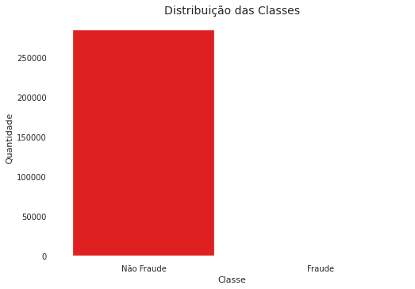
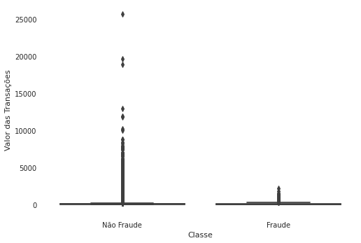
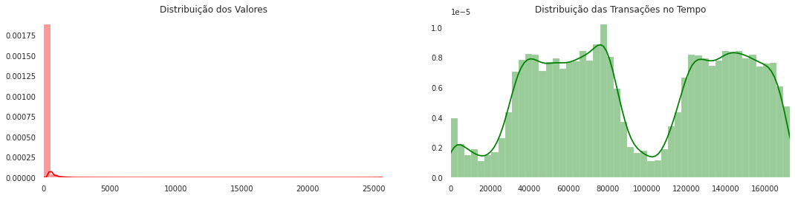
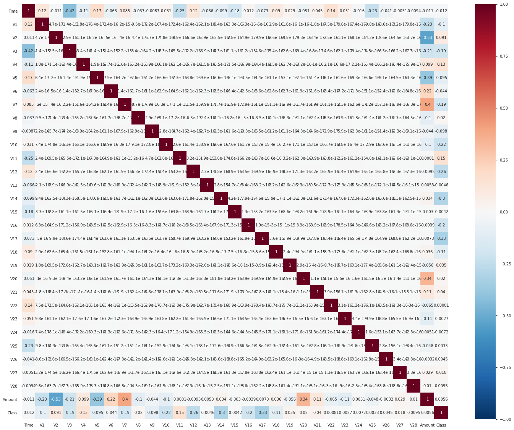
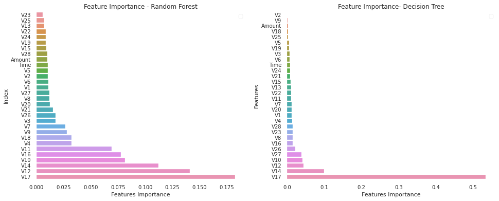
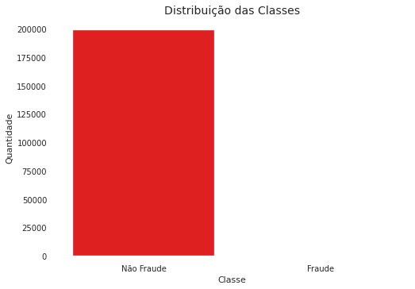
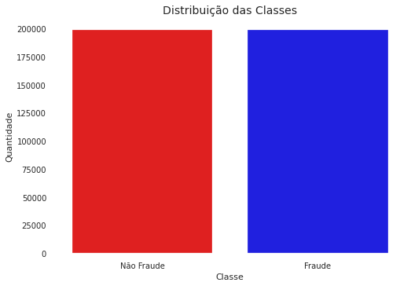
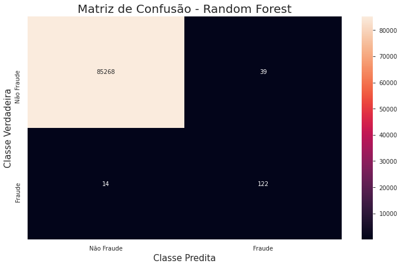

# Trabalho Final - Não Supervisionado

**Autor**: Matheus Jericó Palhares <br>
**LinkedIn**: https://linkedin.com/in/matheusjerico

### Conjunto de Dados - Credit Card Fraud Detection
**Link**:<br> https://www.kaggle.com/mlg-ulb/creditcardfraud

**Contexto**: <br>
É de extrema importância que as empresas identifiquem e reconheçam transações fraudulentas com cartão de crédito, para que os cliente não sejam cobrados pelos itens que não compraram e, as empresas não tomem prejuízo devido a fraude (Kaggle, 2020).

**Conteúdo**:<br>
O dataset contêm transações realizadas com cartões de crédito em setembro de 2013 por portadores de cartões europeus. Este conjunto de dados apresenta transações que ocorreram em dois dias, nas quais temos 492 fraudes em 284.807 transações. O conjunto de dados é altamente desequilibrado, a classe positiva (fraudes) representa 0,172% de todas as transações (Kaggle, 2020).<br>

O dataset contém apenas variáveis de entrada numéricas que são o resultado de uma transformação PCA. Infelizmente, devido a problemas de confidencialidade, não podemos fornecer os recursos originais e mais informações básicas sobre os dados. Features de V1, V2, até V28 são os principais componentes obtidos com o PCA, os únicos recursos que não foram transformados com o PCA são 'Tempo' e 'Valor'. O recurso 'Hora' contém os segundos decorridos entre cada transação e a primeira transação no conjunto de dados. O recurso 'Valor' é o valor da transação, esse recurso pode ser usado para aprendizado sensível a custos dependente de exemplo. O recurso 'Classe' é a variável de resposta e assume o valor 1 em caso de fraude e 0 em caso contrário (Kaggle, 2020).

**Resolução**: <br>
Para resolução do problema, utilizaremos algoritmos de aprendizagem supervisionada. Como o dataset é desbalanceado, mostraremos uma solução de balanceamento (Kaggle, 2020). 

Utilizamos o framwork Scikit-learn para construção dos algorítmos de aprendizagem supervisionada.


## Como foi desenvolvida a Solução?
A solução foi desenvolvida utilizando a linguagem de programação Python e o framework Jupyter Notebook para arquitetura e documentação da implementação. Os passos seguidos para o desenvolvimento:


### 1. Importar as bibliotecas:
- Pandas: Importar o dataset e realizar manipulações com dataframe.
- Numpy: Manipular conjunto de dados e trabalhar com métodos matemáticos.
- Matplotlib e Seaborn: Construção e visualização gráfica.
- Scikit-learn: Aplicar técnicas de normalização e padronização dos dados. Dividir os dados em treinamento, validação e teste. Calcular das métricas de validação dos algorítmos. Criar e treinar modelos de aprendizagem supervisionada.
- XGBoost: Criar e treinar o algorítmo GXBoosting.
- Imblearn: Balancear o dataset.
- Pandas Profiling: Análise gráfica.


### 2. Carregar o conjunto de dados:
Utilizamos a biblioteca Pandas para carregar o conjunto de dados, extrair as informações sobre os tipos dos dados presentes no dataset e verificar a existência de valores faltantes (NaN). Além de realizar a análise na distribuição dos dados (média, mediana, desvio padrão e quartis).

**ANÁLISE**:
- Dataset não possui valores NaN;
- 28 colunas resultantes da técnica de redução de dimensionalidade PCA;
- 1 coluna referente ao valor da transação;
- Class é a coluna target;
- Todos os dados presentes no dataset são dados numéricos.
- Dataset apresenta grande quantidade de outliers na maioria das colunas.

### 3. Análise Exploratória

#### 3.1. Distribuição dos Dados com base na Classe:

    Distribuição das classificações dos dados:
    Transações Não Fraudulentas: 99.83%.
    Transações Fraudulentas: 0.17%.



**ANÁLISE**:
- O dataset é originalmente desbalanceado. A maior parte dos dados são representados por transações não fraudulentas. É necessário aplicar técnicas para rebalancear os dados (dados de treinamento).
- Quando os dados são desbalanceados, temos que utilizar métricas como Recall, Precision e F1-Score para análisar o desempenho do algoritmo.

#### 3.2. Existe diferência nos valores das transações fraudulentas e não fraudulentas?


    Fraude:
    count     492.000000
    mean      122.211321
    std       256.683288
    min         0.000000
    25%         1.000000
    50%         9.250000
    75%       105.890000
    max      2125.870000
    Name: Amount, dtype: float64
    
    Não Fraude:
    count    284315.000000
    mean         88.291022
    std         250.105092
    min           0.000000
    25%           5.650000
    50%          22.000000
    75%          77.050000
    max       25691.160000
    Name: Amount, dtype: float64





**ANÁLISE**:
- As transações não fraudulentas possui um range de valores muito maior.

#### 3.3. Distribuição das Transações



**ANÁLISE**: 
- É possível observar que não há uma grande diferença na distribuição dos valores das transações e no horário delas entre as fraudulentas e a totalidade de transações.

#### 3.4. Correlação entre as variáveis

- Primeiramente, correlação não implica causalidade.




#### 3.5. Features mais importantes

- Para analisar as features mais relevantes para detecção de Fraude, utilizamos dois algoritmos do método Ensemble para extrair as features. 




**ANÁLISE**:
- Para o algoritmo Random Forest, as features mais importantes foram:
    1. V23;
    2. V24;
    3. V13;
    4. V25;
    5. V19.
    
    
- Para o algoritmo Decision Tree, as features mais importantes foram:
    1. V2;
    2. V3;
    3. V9;
    4. V18;
    5. V25.
    
Entre os dois algoritmos, tivemos pouca divergência. Entretando, considerei o resultado das features mais importantes do algoritmo **Random Forest**, pois o mesmo pondera mais variáveis para tomada de decisão.

### 4. Processamento dos dados

#### 4.1. Removendo as features com menor relevância
- Após analisar a análise de *feature importance*, removemos as 5 features com menor importância para redução na quantidade de dados.
```
    Features com menor importância: ['V23', 'V25', 'V13', 'V22', 'V24']
```

#### 4.2. Aplicando padronização e normalização nos dados com larga escala
- Aplicamos a técnica pois a feature apresenta uma gama grande de valores. Utilizamos a biblioteca Standard Scaler do scikit-learn para padronizar as feature *Amount*. A ideia de utilizar essa transformação é fazer com que os valores da feature possua média 0 e devio padrão igual a 1. Transformando a distribuição da features em uma distribuição normal.
- Aplicamos a técnica MinMax Scaler na feature *Time* para reguzir a gama de valores, em um range pequeno.


### 5. SMOTE Oversampling & Machine Learning¶

- Aplicando a técnica de SMOTE Oversampling para rebalancear o dataset;
- Como o dataset é muito desbalanceado, o modelo se torna enviesado para a classe (não fraudulenta) que tem a maior quantidade de dados;
- Dessa forma, aplico a técnica de oversampling nos dados de treino, sem manipular os dados de teste:
    - Isso faz com que o treinamento do modelo seja com duas classes balanceadas, fazendo com que o modelo não fique enviesado;
    - Os dados de testes seguem os dados originais desbalanceados.


#### 5.1. Separando dados de treino e teste
**ANÁLISE**:
- Aplicamos a técnica de rebalanceamento do dataset apenas nos dados de treino;
- Não aplicamos a técnica nos dados de teste pois diverge da realidade;
- Aplicar a técnica nos dados de treino é ideal para não termos um modelo enviesado.

#### 5.2. Comparando a distribuição das classes dos dados de treino

##### 5.2.1. Dados de treino desbalanceados




##### 5.2.2. Dados de treino balanceados




### 6. ITS TIME!! Machine Learning

#### 6.1 Métodos Ensemble

Fonte: Global Software

##### 6.1.1. Bagging (Random Forest)

No Bagging os classificadores são treinados de forma independente por diferentes conjuntos de treinamento através do método de inicialização. Para construí-los é necessário montar k conjuntos de treinamento idênticos e replicar esses dados de treinamento de forma aleatória para construir k redes independentes por re-amostragem com reposição. Em seguida, deve-se agregar as k redes através de um método de combinação apropriada, tal como a maioria de votos (Maisa Aniceto, 2017).

##### 6.1.2. Boosting

No Boosting, de forma semelhante ao Bagging, cada classificador é treinado usando um conjunto de treinamento diferente. A principal diferença em relação ao Bagging é que os conjuntos de dados re-amostrados são construídos especificamente para gerar aprendizados complementares e a importância do voto é ponderado com base no desempenho de cada modelo, em vez da atribuição de mesmo peso para todos os votos. Essencialmente, esse procedimento permite aumentar o desempenho de um limiar arbitrário simplesmente adicionando learners mais fracos (Maisa Aniceto, 2017). Dada a utilidade desse achado, Boosting é considerado uma das descobertas mais significativas em aprendizado de máquina (LANTZ, 2013).

#### 6.2. Comparando acurácia de 7 modelos de classificação utilizando validação cruzada
- Será selecionado 4 modelos para tunning de hiperparâmetros;
- Posteriormente, será selecionado o modelo que obter as melhores métricas.
```
    Nome do Modelo                | Acurácia Média  | Desvio Padrão
    Logistic Regression:                 94.28%          0.03%
    Naive Bayes:                         90.11%          0.06%
    Decision Tree:                       99.7%           0.02%
    Random Forest:                       99.98%          0.0%
    XGB Classifier:                      99.95%          0.0%
    Gradient Boosting Classifier:        97.56%          0.04%
    SVM:                                 97.19%          0.04%
```

**ANÁLISE**:
  - Selecionei os seguintes modelos:
      - Gradient Boosting Classifier;
      - Random Forest;
      - XGB Classifier;
      - Logistic Regression.
  - Não foi escolhido o algorítmo Decision Tree, pois o Random Forest é uma versão melhorada do Decision Tree, pois utiliza varias arvores de decisão para ponderar a classe escolhida como resultado final.


#### 6.3. Aplicando GridSearch para tunning e Validando com os dados de teste
- A métrica escolhida para otimizar os hiperparâmetros foi a F1-Score, tendo em vista que o dataset é desbalanceado.
- Logo, a métrica escolhida para selecionar o melhor modelo foi a F1-Score, pelo fato do dataset ser desbalanceado.


##### 6.3.1. Logistic Regression
- Parâmetros escolhidos para tunning:
  - Solver: 'liblinear' e 'lbfgs'
  - C: '10' e '25'

```python
                  precision    recall  f1-score   support
    
               0       1.00      0.97      0.99     85307
               1       0.05      0.93      0.10       136
    
        accuracy                           0.97     85443
       macro avg       0.53      0.95      0.54     85443
    weighted avg       1.00      0.97      0.98     85443
    
    ------------------------------------------------------
    Matriz de Confusão:
     [83016  2291]
     [   10   126]
    ------------------------------------------------------
    Logistic Regression f1-score: 0.09870740305522914
```

    Melhores parâmetros para o algorítmo Logistic Regression: {'C': 10, 'penalty': 'l2', 'solver': 'liblinear'}


##### 6.3.2 Gradient Boosting Classifier
- Parâmetros escolhidos para tunning:
  - Learning Rate: '0.01' e '0.15'
  - Max depth: '15' e '25'
  - Number estimators: '100' e '200'

```python
                  precision    recall  f1-score   support
    
               0       1.00      1.00      1.00     85307
               1       0.68      0.88      0.77       136
    
        accuracy                           1.00     85443
       macro avg       0.84      0.94      0.88     85443
    weighted avg       1.00      1.00      1.00     85443
    
    ------------------------------------------------------
    Matriz de Confusão:
     [85252    55]
     [   17   119]
    ------------------------------------------------------
    GradientBoostingClassifier f1-score: 0.767741935483871
```

    Melhores parâmetros para o algorítmo Gradient Boosting: {'learning_rate': 0.15, 'max_depth': 15, 'n_estimators': 100}


##### 6.3.3. XGB Classifier
- Parâmetros escolhidos para tunning:
  - Learning Rate: '0.01' e '0.15'
  - Max depth: '15' e '25'
  - Number estimators: '100' e '200'

```python
                  precision    recall  f1-score   support
    
               0       1.00      1.00      1.00     85307
               1       0.73      0.88      0.80       136
    
        accuracy                           1.00     85443
       macro avg       0.86      0.94      0.90     85443
    weighted avg       1.00      1.00      1.00     85443
    
    ------------------------------------------------------
    Matriz de Confusão
     [85262    45]
     [   16   120]
    ------------------------------------------------------
    XGBClassifier f1-score: 0.7973421926910299
```

    Melhores parâmetros para o algorítmo XGB: {'learning_rate': 0.15, 'max_depth': 15, 'n_estimators': 200}


##### 6.3.4 Random Forest Classifier
- Parâmetros escolhidos para tunning:
  - Max depth: '15' e '25'
  - Number estimators: '100' e '200'

```python
                  precision    recall  f1-score   support
    
               0       1.00      1.00      1.00     85307
               1       0.76      0.90      0.82       136
    
        accuracy                           1.00     85443
       macro avg       0.88      0.95      0.91     85443
    weighted avg       1.00      1.00      1.00     85443
    
    ------------------------------------------------------
    Matriz de Confusão
     [85268    39]
     [   14   122]
    ------------------------------------------------------
    RandomForestClassifier f1-score: 0.8215488215488216
```

    Melhores parâmetros para o algorítmo Random Forest: {'max_depth': 25, 'max_features': 'auto', 'n_estimators': 100}


### 7. Métricas

#### 7.1. ROC AUC

    Métrica ROC AUC:
    Logistic Regression:           94.98%
    Gradient Boosting Classifier:  93.72%
    XGB Classifier:                94.1%
    Random Forest Classifier:      94.8%


**ANÁLISE**:
- Os quatro algoritmos tiverem resultados muito próximo.
- Dessa forma, não podemos selecionar nenhum algoritmo utilizando métrica ROC AUC.

#### 7.2. Precision

    Métrica Precisão (Precision):
    Logistic Regression:           5.21%
    Gradient Boosting Classifier:  68.39%
    XGB Classifier:                72.7%
    Random Forest Classifier:      75.78%


**ANÁLISE**:
- O algorítmo Random Forest teve uma performace superior aos demais algorítmos analisando a métrica de Precisão.

#### 7.3. Recall

    Métrica Revocação (Recall):
    Logistic Regression:           92.65%
    Gradient Boosting Classifier:  87.5%
    XGB Classifier:                88.2%
    Random Forest Classifier:      89.7%


**ANÁLISE**:
- O algorítmo de Regressão Logística obteve um melhor desempenho comparado aos algorítmos que utilizam métodos Ensemble;
- Entretanto, a diferênca é inferior a 3%.

#### 7.4. F1-Score

    Métrica F1-Score:
    Logistic Regression:           9.87%
    Gradient Boosting Classifier:  76.8%
    XGB Classifier:                79.7%
    Random Forest Classifier:      82.15%


**ANÁLISE**:
- O algorítmo Random Forest obteve o melhor desempenho analisando a métrica F1-Score.
- A métrica F1-Score é uma das mais importante quando temos um dataset desbalanceado.

### 8. Matriz de Confusão
- Vamos analisar a matriz de confusão do algoritmo que obteve melhor desempenho.




## CONCLUSÃO

**ANÁLISE**:
- Após aplicar algorítmos de Aprendizagem Supervisionada (Regressão Logística e Métodos Ensemble), podemos concluir que os métodos Ensemble são indicados para casos que temos dados desbalanceados. No problema apresentado, detecção de fraude utilizando cartão de crédito, o algorítmo Random Forest obteve melhor performace analisando a métrica de F1-Score.
- Comparando o desempenho com o algorítmo de Aprendizado Não-Supervisionado, Auto Encoder, obtivemos melhor desempenho utilizando algorítmo de Aprendizagem Supervisionado.
- Os algorítmos de Aprendizagem Não-Supervionada são indicados para os casos que não temos os rótulos das transações Fraudulentas, pois obtemos um bom desempenho utilizando o Auto Encoder, minimizando o Falso Negativo.
- algorítmos de Aprendizagem Supervisionada apresentam um desempenho superior, pelo fator de aprender o que são transações fraudulentas além das transações não fraudulentas. Entretanto é necessário aplicar técnicas de balanceamentos dos dados de Treino para que o modelo não fica viesado.
