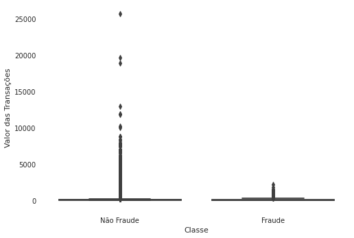
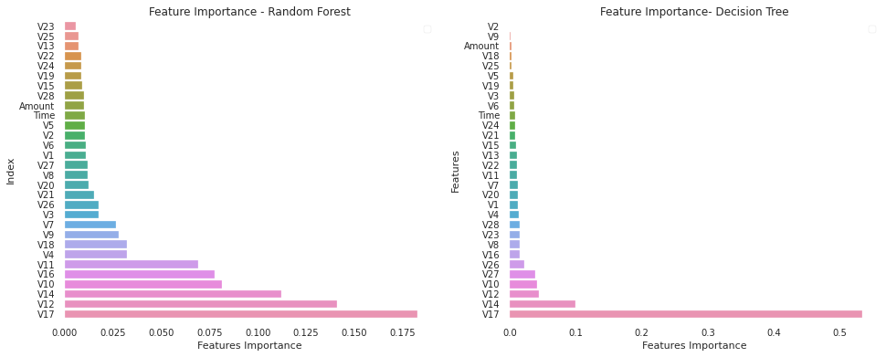
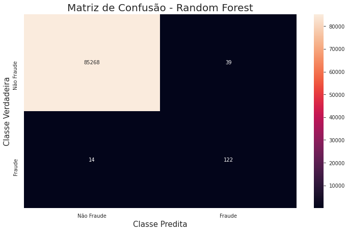

% Detecção de Fraudes em Cartão de Crédito com Auto Encoder
% Trabalho Final - Aprendizagem Não Supervisionada
% Matheus Jericó Palhares - 26 Maio 2020

---

# Sumário

1. Conjunto de Dados
1. Bibliotecas
1. Leitura dos Dados
1. Análise Exploratória
1. Processamento dos Dados
1. SMOTE (Balanceamento dos Dados)
1. Machine Learning
1. Métricas
1. Conclusão 

---

### 1. Conjunto de Dados

[Credit Card Fraud Detection](https://www.kaggle.com/mlg-ulb/creditcardfraud)

:::::::::::::: {.columns}
::: {.column width="50%"}

#### 1.1. Contexto

É de extrema importância que as empresas identifiquem e reconheçam transações fraudulentas com cartão de crédito, para que os cliente não sejam cobrados pelos itens que não compraram e, as empresas não tomem prejuízo devido a fraude (Kaggle, 2020).

:::
::: {.column width="50%"}

#### 1.2. Conteúdo

O dataset contém transações realizadas com cartões de crédito em setembro de 2013 por portadores de cartões europeus. Este conjunto de dados apresenta transações que ocorreram em dois dias, nas quais temos 492 fraudes em 284.807 transações. O conjunto de dados é altamente desequilibrado, a classe positiva (fraudes) representa 0,172% de todas as transações (Kaggle, 2020).<br>

:::
::::::::::::::

---

:::::::::::::: {.columns}
::: {.column width="50%"}

#### 1.2. Conteúdo

O dataset contém apenas variáveis de entrada numéricas que são o resultado de uma transformação PCA (problemas de confidencialidade. Features de V1, V2, até V28 são os principais componentes obtidos com o PCA, os únicos recursos que não foram transformados com o PCA são 'Tempo' e 'Valor'. O recurso 'Classe' é a variável de resposta e assume o valor 1 em caso de fraude e 0 em caso contrário (Kaggle, 2020).

:::
::: {.column width="50%"}


#### 1.3. Resolução

Para resolução do problema, utilizaremos algoritmos de aprendizagem supervisionada. Como o dataset é desbalanceado, mostraremos uma solução de balanceamento (Kaggle, 2020). 

Utilizamos o framework Scikit-learn para construção dos algorítmos de aprendizagem supervisionada.

:::
::::::::::::::


---

### 2. Bibliotecas

- **Pandas**: Importar o dataset e realizar manipulações com dataframe.
- **Numpy**: Manipular conjunto de dados e trabalhar com métodos matemáticos.
- **Matplotlib** e **Seaborn**: Construção e visualização gráfica.
- **Scikit-learn**: Aplicar técnicas de normalização e padronização dos dados. Dividir os dados em treinamento, validação e teste. Calcular das métricas de validação dos algorítmos. Criar e treinar modelos de aprendizagem supervisionada.
- **XGBoost**: Criar e treinar o algorítmo GXBoosting.
- **Imblearn**: Balancear o dataset.
- **Pandas Profiling**: Análise gráfica.

---

### 3. Leitura dos Dados:

- Dataset não possui valores NaN;
- 28 colunas resultantes da técnica de redução de dimensionalidade PCA;
- 1 coluna referente ao valor da transação;
- Class é a coluna target;
- Todos os dados presentes no dataset são dados numéricos.

---

### 4. Análise Exploratória

#### 4.1. Distribuição dos Dados com base na Classe
```
Distribuição das classificações dos dados:
Transações Não Fraudulentas: 99.83%.
Transações Fraudulentas: 0.17%.
```
:::::::::::::: {.columns}
::: {.column width="50%"}

{width=80% height=80%}

:::
::: {.column width="50%"}

::: incremental

**Análise**: <br>

- O dataset é desbalanceado. A maior parte dos dados são representados por transações não fraudulentas.
- Quando os dados são desbalanceados, temos que utilizar métricas como Recall, Precision e F1-Score para análisar o desempenho do algoritmo.

:::

:::
::::::::::::::

---

#### 4.2. Existe diferência nos valores das transações fraudulentas e não fraudulentas?

```
Fraude:                                     Não Fraude:
count     492.000000                        count     284315.000000    
mean      122.211321                        mean          88.291022
std       256.683288                        std          250.105092
min         0.000000                        min            0.000000
25%         1.000000                        25%            5.650000
50%         9.250000                        50%           22.000000
75%       105.890000                        75%           77.050000
max      2125.870000                        max        25691.160000
Name: Amount, dtype: float64                Name: Amount, dtype: float64
```

:::::::::::::: {.columns}
::: {.column width="50%"}



:::
::: {.column width="50%"}


**Análise**: <br>

- As transações não fraudulentas possui um range de valores muito maior.

:::
::::::::::::::

---

#### 4.3. Distribuição das Transações


**Análise**:<br>

- 75% dos dados são transações com valores inferiores a 100 euros;
- A Sanzonalidade é devido ao período de aquisição dos dados (2 dias).

---

#### 4.4. Correlação entre as variáveis

{width=100% height=60%}

---

#### 4.5. Feature Importance

Para analisar as features mais relevantes para detecção de Fraude, utilizamos dois algoritmos do método Ensemble. 

{width=80% height=80%}
    
Entre os dois algoritmos, tivemos pouca divergência. Entretando, considerei o resultado das features mais importantes do algoritmo **Random Forest**, pois o mesmo pondera mais variáveis para tomada de decisão.

---

### 5. Processamento dos dados

#### 5.1. Removendo as Features com Menor Importância
Após analisar a análise de *feature importance*, removemos as 5 features com menor importância para redução na quantidade de dados.
```
Features com menor importância: ['V23', 'V25', 'V13', 'V22', 'V24']
```

#### 5.2. Padronização e Normalização
- Utilizamos a biblioteca Standard Scaler do scikit-learn para padronizar as feature *Amount*, pois a mesma possui uma gama de valores;
- O objetivo de padronizar a features é fazer com que os valores possuam média 0 e devio padrão igual a 1;
- Transformando a distribuição da features em uma distribuição normal;
- Aplicamos a técnica Min Max Scaler na feature *Time* para reguzir a gama de valores, em um range pequeno (0,1).

---

### 6. SMOTE Oversampling
- A técnica de balanceamento SMOTE utiliza o algoritmo Knn para inserir novos dados;
- Como o dataset é muito desbalanceado, o modelo se torna enviesado para a classe (não fraudulenta) que tem a maior quantidade de dados;
- Dessa forma, aplicamos a técnica de oversampling nos dados de treino, sem manipular os dados de teste:
    - Isso faz com que o treinamento do modelo seja com duas classes balanceadas, fazendo com que o modelo não fique enviesado;
    - Os dados de testes seguem os dados originais desbalanceados.

#### 6.1. Separando dados de treino e teste
- Aplicamos a técnica de rebalanceamento do dataset apenas nos dados de treino;
- Não aplicamos a técnica nos dados de teste pois diverge da realidade;
- Aplicar a técnica nos dados de treino é ideal para não termos um modelo enviesado.

---

#### 6.2. Comparando a distribuição das classes dos dados de treino

:::::::::::::: {.columns}
::: {.column width="50%"}

##### 6.2.1. Dados de treino desbalanceados


:::
::: {.column width="50%"}

##### 6.2.2. Dados de treino balanceados


:::
::::::::::::::

---

### 7. Machine Learning

#### 7.1 Métodos Ensemble


Fonte: Global Software

--- 

##### 7.1.1. Bagging (Random Forest)

No Bagging os classificadores são treinados de forma independente por diferentes conjuntos de treinamento através do método de inicialização. Para construí-los é necessário montar k conjuntos de treinamento idênticos e replicar esses dados de treinamento de forma aleatória para construir k redes independentes por re-amostragem com reposição. Em seguida, deve-se agregar as k redes através de um método de combinação apropriada, tal como a maioria de votos (Maisa Aniceto, 2017).

##### 7.1.2. Boosting (XGBoost)

No Boosting, de forma semelhante ao Bagging, cada classificador é treinado usando um conjunto de treinamento diferente. A principal diferença em relação ao Bagging é que os conjuntos de dados re-amostrados são construídos especificamente para gerar aprendizados complementares e a importância do voto é ponderado com base no desempenho de cada modelo, em vez da atribuição de mesmo peso para todos os votos. Essencialmente, esse procedimento permite aumentar o desempenho de um limiar arbitrário simplesmente adicionando learners mais fracos (Maisa Aniceto, 2017). Dada a utilidade desse achado, Boosting é considerado uma das descobertas mais significativas em aprendizado de máquina (LANTZ, 2013).

---

#### 7.2. Seleção de Algorítmos utilizando Validação Cruzada
Comparamos o desempenho dos Algorítmos: *Logistic Regression, Naive Bayes, Decision Tree, Random Forest, XGBoosting, Gradient Boosting*.
```
Nome do Modelo                | Acurácia Média  | Desvio Padrão
Logistic Regression:                 94.28%          0.03%
Naive Bayes:                         90.11%          0.06%
Decision Tree:                       99.7%           0.02%
Random Forest:                       99.98%          0.0%
XGB Classifier:                      99.95%          0.0%
Gradient Boosting Classifier:        97.56%          0.04%
SVM:                                 97.19%          0.04%
```

**Análise**:<br>

- Selecionei os seguintes modelos:
  - Gradient Boosting Classifier;
  - Random Forest;
  - XGB Classifier;
  - Logistic Regression.

---

#### 7.3. GridSearch e Validação
- Utilizamos a métrica F1-Score para otimizar os hiperparâmetros dos Algorítmos de Aprendizagem Supervisionada.

---

##### 7.3.1. Logistic Regression

Parâmetros escolhidos para tunning:<br>

- Solver: 'liblinear' e 'lbfgs';
- C: '10' e '25'.

```
              precision    recall  f1-score   support

           0       1.00      0.97      0.99     85307
           1       0.05      0.93      0.10       136

    accuracy                           0.97     85443
   macro avg       0.53      0.95      0.54     85443
weighted avg       1.00      0.97      0.98     85443

------------------------------------------------------
Matriz de Confusão:
 [83016  2291]
 [   10   126]
------------------------------------------------------
Logistic Regression f1-score: 0.09870740305522914
```

---

##### 7.3.2 Gradient Boosting Classifier
Parâmetros escolhidos para tunning:<br>

- Learning Rate: '0.01' e '0.15';
- Max depth: '15' e '25';
- Number estimators: '100' e '200'.

```
              precision    recall  f1-score   support

           0       1.00      1.00      1.00     85307
           1       0.68      0.88      0.77       136

    accuracy                           1.00     85443
   macro avg       0.84      0.94      0.88     85443
weighted avg       1.00      1.00      1.00     85443

------------------------------------------------------
Matriz de Confusão:
 [85252    55]
 [   17   119]
------------------------------------------------------
GradientBoostingClassifier f1-score: 0.767741935483871
```

---

##### 7.3.3. XGB Classifier
Parâmetros escolhidos para tunning:<br>

- Learning Rate: '0.01' e '0.15';
- Max depth: '15' e '25';
- Number estimators: '100' e '200'.

```
              precision    recall  f1-score   support

           0       1.00      1.00      1.00     85307
           1       0.73      0.88      0.80       136

    accuracy                           1.00     85443
   macro avg       0.86      0.94      0.90     85443
weighted avg       1.00      1.00      1.00     85443

------------------------------------------------------
Matriz de Confusão
 [85262    45]
 [   16   120]
------------------------------------------------------
XGBClassifier f1-score: 0.7973421926910299
```

---

##### 7.3.4 Random Forest Classifier
Parâmetros escolhidos para tunning:<br>

- Max depth: '15' e '25';
- Number estimators: '100' e '200'.

```
              precision    recall  f1-score   support

           0       1.00      1.00      1.00     85307
           1       0.76      0.90      0.82       136

    accuracy                           1.00     85443
   macro avg       0.88      0.95      0.91     85443
weighted avg       1.00      1.00      1.00     85443

------------------------------------------------------
Matriz de Confusão
 [85268    39]
 [   14   122]
------------------------------------------------------
RandomForestClassifier f1-score: 0.8215488215488216
```

---

### 8. Métricas

#### 8.1. ROC AUC
```
Métrica ROC AUC:
Logistic Regression:           94.98%
Gradient Boosting Classifier:  93.72%
XGB Classifier:                94.1%
Random Forest Classifier:      94.8%
```
**Análise**: <br>

- Analisando a métrica de ROC AUC, os quatro Algorítmos tiverem resultados semelhantes;
- Dessa forma, não podemos selecionar nenhum dos Algorítmos utilizando a métrica ROC AUC.

---

#### 8.2. Precision
```
Métrica Precisão (Precision):
Logistic Regression:           5.21%
Gradient Boosting Classifier:  68.39%
XGB Classifier:                72.7%
Random Forest Classifier:      75.78%
```
**Análise**: <br>

- Analisando a métrica de Precisão, os Algotítmos do Método Ensemble tiveram um desempenho muito superior em relação a Regressão Logísitica;
- O algorítmo Random Forest obteve performace superior aos demais algorítmos.

---

#### 8.3. Recall
```
Métrica Revocação (Recall):
Logistic Regression:           92.65%
Gradient Boosting Classifier:  87.5%
XGB Classifier:                88.2%
Random Forest Classifier:      89.7%
```
**Análise**: <br>

- Analisando a métrica de Revocação, o Algorítmo de Regressão Logística teve o melhor desempenho.
- Entretanto, a diferênca entre a performace da Regressão Logística e Random Forest é inferior a 3%.
- Recall é uma das métricas mais importantes para Detecção de Fraude, pois o objetivo é minimizar o Falso Negativo.

---

#### 8.4. F1-Score
```
Métrica F1-Score:
Logistic Regression:           9.87%
Gradient Boosting Classifier:  76.8%
XGB Classifier:                79.7%
Random Forest Classifier:      82.15%
```
**Análise**: <br>

- Analisando a métrica de F1-Score, que é uma métrica que pondera a revocação e a precisão, o Algorítmo Random Forest teve o melhor desempenho.
- A métrica F1-Score é uma das mais importante quando temos um dataset desbalanceado.

---

#### 8.5. Matriz de Confusão (Random Forest)
Vamos analisar a matriz de confusão do algoritmo que obteve melhor desempenho.



---

### 9. CONCLUSÃO

- Após aplicar algorítmos de Aprendizagem Supervisionada (Regressão Logística e Métodos Ensemble), podemos concluir que os métodos Ensemble são indicados para casos que temos dados desbalanceados. No problema apresentado, detecção de fraude utilizando cartão de crédito, o algorítmo Random Forest teve a melhor performace analisando a métrica de F1-Score.
- Os Algorítmos de Aprendizagem Supervisionada apresentam ótimo desempenho para Análise de Fraude, pelo fator de aprender o que são transações fraudulentas e transações não fraudulentas. Entretanto é necessário aplicar técnicas de balanceamentos dos dados de Treino para que o modelo não fica viesado.
- Os algorítmos de Aprendizagem Não-Supervionada são indicados para os casos que não temos os rótulos das transações Fraudulentas, mas temos os dados das transações normais. Um dos Algorítmos mais indicados para essa problemática é o [Auto Encoder](https://github.com/matheusjerico/AutoEncoderFraudDetection).